# 🚀 Complete Deployment Guide

## 🎯 **Overview: How Everything Works Together**

```mermaid
graph TD
    A[👨‍💻 Your Code] --> B[📱 GitHub Repository]
    B --> C[⚡ GitHub Actions]
    C --> D[🔫 Scrape Gun Data]
    D --> E[💾 Store as Artifact]
    E --> F[☁️ Render Platform]
    F --> G[📥 Download Latest Data]
    G --> H[🤖 Discord Bot 24/7]
    H --> I[👥 Users Use Slash Commands]
    
    C --> J[🔄 Runs Twice Daily]
    J --> D
```



---

## 📋 **Step-by-Step Deployment**

### **Step 1: Create GitHub Repository**

1. **Create a new repository on GitHub:**
   ```
   Repository name: warzone-gun-search-bot
   Description: Discord bot for Warzone weapon loadouts
   Public or Private: Your choice
   ```

2. **Upload your code:**
   ```bash
   # In your project folder
   git init
   git add .
   git commit -m "Initial commit"
   git branch -M main
   git remote add origin https://github.com/YOUR_USERNAME/warzone-gun-search-bot.git
   git push -u origin main
   ```

### **Step 2: Configure GitHub Secrets**

In your GitHub repository → Settings → Secrets and variables → Actions:

| Secret Name | Value | Purpose |
|-------------|-------|---------|
| `DISCORD_SEARCH_BOT_TOKEN` | Your Discord bot token | For the search bot |
| `GITHUB_TOKEN` | Auto-provided by GitHub | For artifact downloads |

*Note: No Imgur secrets needed since we removed image uploads*

### **Step 3: GitHub Actions Will Auto-Run**

Once you push the code:
- ✅ Scraper runs automatically **twice daily** (8 AM & 8 PM UTC)
- ✅ Scrapes all **232 weapons** from 13 categories
- ✅ Saves data as GitHub artifact (30-day retention)
- ✅ Creates summary reports in Actions tab

### **Step 4: Deploy Discord Bot to Render**

#### **4a. Create Render Account**
- Go to [render.com](https://render.com)
- Sign up (free tier available)

#### **4b. Connect Your Repository**
1. Click **"New +"** → **"Web Service"**
2. Connect your GitHub repository
3. Configure deployment:

| Setting | Value |
|---------|--------|
| **Name** | `warzone-gun-search-bot` |
| **Runtime** | `Python 3` |
| **Build Command** | `pip install -r discord_bot_requirements.txt` |
| **Start Command** | `python start.py` |
| **Plan** | `Free` |

#### **4c. Set Environment Variables in Render**
In Render dashboard → Your service → Environment:

```env
DISCORD_SEARCH_BOT_TOKEN=your_actual_discord_bot_token_here
GITHUB_TOKEN=your_github_token_here  
GITHUB_REPO_OWNER=your_username
GITHUB_REPO_NAME=warzone-gun-search-bot
PORT=10000
```

### **Step 5: What Happens When Bot Starts**

```
🚀 Render starts your service
🔄 start.py downloads latest gun database from GitHub artifacts  
📊 Validates 232 weapons across 13 categories
🤖 Starts Discord bot with slash commands
🌐 Starts health check server (keeps Render awake)
✅ Bot responds to commands 24/7!
```

---

## 🎮 **Discord Bot Setup**

### **Create Discord Bot**

1. **Go to [Discord Developer Portal](https://discord.com/developers/applications)**
2. **Create New Application** → Name it "Warzone Gun Search"
3. **Go to Bot tab** → Create bot
4. **Copy the token** → Add to Render environment variables
5. **Bot Permissions:** 
   - ✅ Send Messages
   - ✅ Use Slash Commands  
   - ✅ Embed Links

### **Invite Bot to Server**

1. **Go to OAuth2 → URL Generator**
2. **Scopes:** `bot`, `applications.commands`
3. **Permissions:** Send Messages, Embed Links
4. **Copy invite URL** → Use in your Discord server

---

## 🎯 **Available Commands**

Once deployed, users can use:

### **`/search <weapon_name>`**
```
/search c9          → Find all C9 variants
/search ak          → Find all AK weapons  
/search kar         → Find Kar98k variants
```

### **`/gun <weapon_name>`**
```
/gun "C9"           → Get detailed C9 loadout (best match)
/gun "FFAR 1"       → Get FFAR 1 details with attachments
```

### **`/top [mode] [category]`**
```
/top Resurgence "Long Range"     → Top 10 Resurgence long-range
/top Multiplayer "Assault Rifle" → Top 10 multiplayer ARs
/top Verdansk Sniper            → Top 10 Verdansk snipers
```

### **`/stats`**
```
Shows database info: 232 weapons, last updated, categories
```

---

## 💰 **Cost Breakdown**

### **GitHub (Free)**
- ✅ Repository hosting
- ✅ GitHub Actions (2000 minutes/month free)
- ✅ Artifact storage (30 days)

### **Render (Free Tier)**
- ✅ 750 hours/month (enough for 24/7)
- ✅ 512 MB RAM
- ✅ Custom domains
- ❌ Sleeps after 15 minutes of inactivity*

*The health check server prevents sleeping

### **Discord (Free)**
- ✅ Bot hosting
- ✅ Unlimited slash commands
- ✅ Embed messages

**Total monthly cost: $0** 🎉

---

## 🔄 **How Updates Work**

### **Automatic Updates**
1. **GitHub Actions scrape twice daily**
2. **Fresh data saved as artifacts** 
3. **Bot restarts on Render** (manual or auto-deploy)
4. **start.py downloads latest data**
5. **Users get fresh weapon info**

### **Manual Updates**
```bash
# To trigger immediate scraping
GitHub → Actions → "Scrape Gun Database" → Run workflow

# To restart bot with fresh data  
Render → Your service → Manual Deploy
```

---

## 🔍 **Monitoring & Logs**

### **GitHub Actions**
- View scraping results: GitHub → Actions tab
- See weapon counts and any errors
- Download raw database files

### **Render Logs**
- View bot startup: Render → Your service → Logs
- Monitor Discord command usage
- Check health status

### **Discord**
- Test commands: `/stats` shows database info
- Verify responses: All commands should work instantly

---

## 🛠️ **Troubleshooting**

### **Bot Not Responding**
1. Check Discord bot token in Render environment
2. Verify bot has proper permissions in Discord server
3. Check Render logs for startup errors

### **"No Database" Errors**
1. Ensure GitHub Actions have run successfully
2. Check GitHub token permissions in Render
3. Manually trigger scraping workflow

### **Commands Not Showing**
1. Wait 1 hour for Discord to sync slash commands
2. Re-invite bot with applications.commands scope
3. Check bot permissions in Discord server

---

## 🎯 **Final Checklist**

Before going live:

- [ ] Code pushed to GitHub repository
- [ ] GitHub secrets configured (Discord bot token)
- [ ] GitHub Actions ran successfully (check artifacts)
- [ ] Discord bot created with proper permissions  
- [ ] Render service deployed and running
- [ ] Render environment variables set
- [ ] Bot invited to Discord server
- [ ] Test all slash commands work

---

## 🚀 **Go Live!**

Once everything is set up:

1. **Users can start using commands immediately**
2. **Database updates automatically twice daily**
3. **Bot runs 24/7 on Render free tier**
4. **Zero ongoing maintenance required**

**Your Discord server now has a professional weapon database bot!** 🎮

---

## 📈 **Optional Upgrades**

### **Render Paid Tier ($7/month)**
- No sleeping (always responsive)
- More RAM and CPU
- Better uptime guarantees

### **Custom Domain**
- Point your domain to the Render service
- Professional health check URLs

### **Analytics**
- Monitor command usage
- Track popular weapons
- User engagement metrics

**Start with the free tier - it works perfectly for most Discord servers!** 